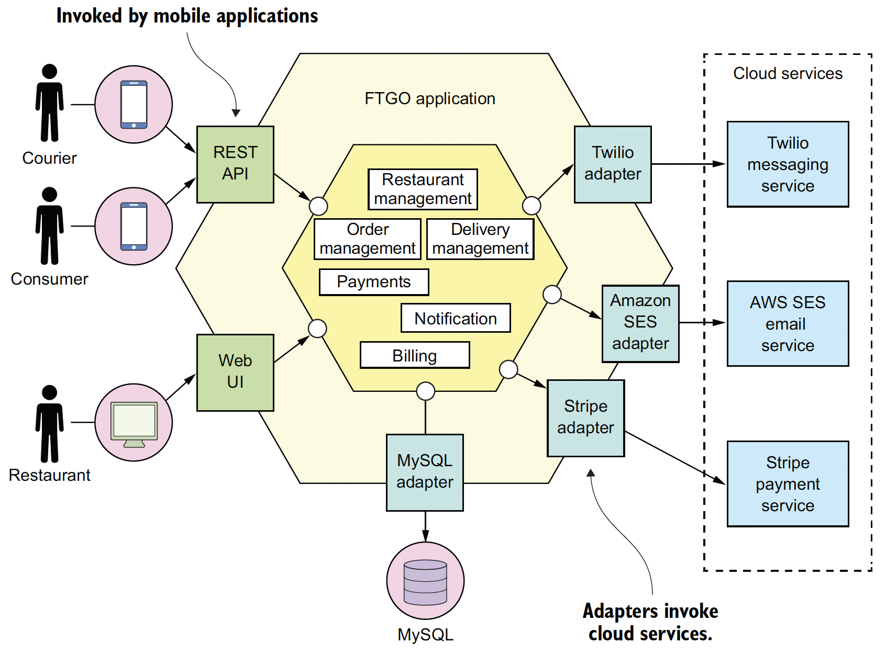
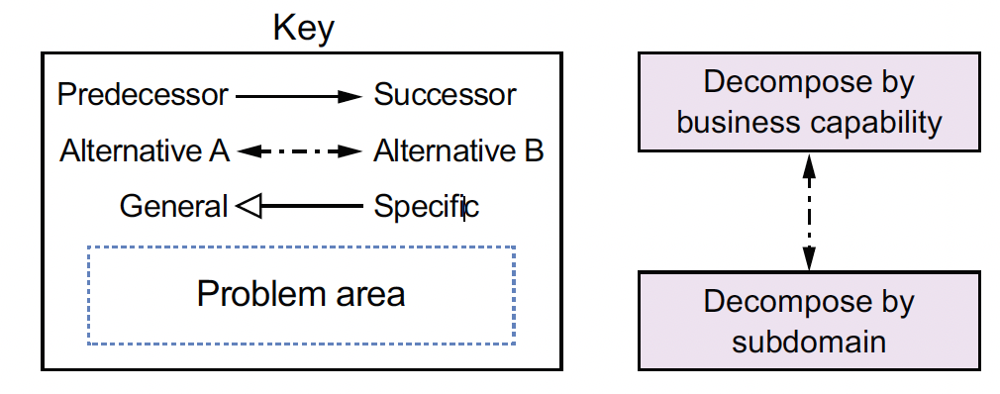
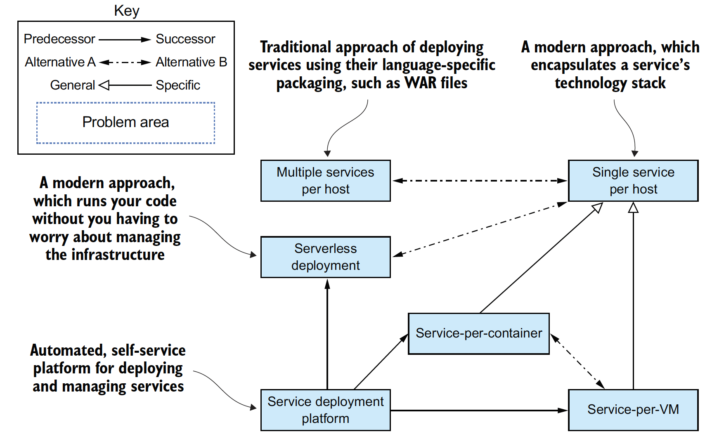

# Chapter 01. Escaping monolithic hell

## Outline
- The symptoms of monolithic hell and how to escape it by adopting the microservice architecture
- The essential characteristics of the microservice architecture and its benefits and drawbacks
- How microservices enable the DevOps style of development of large, complex applications
- The microservice architecture pattern language and why you should use it

## 1.1 The slow march toward monolithic hell
### 1.1.1 The architecture of the FTGO application
- The FTGO application has a hexagonal architecture
  
- In a hexagonal architecture
  - The core of the application consists of the business logic
  - Surrounding the business logic are various adapters that implement UIs (inbound adapters) and integrate with external systems (outbound adapters)

### 1.1.2 The benefits of the monolithic architecture
- **WHEN**: the application was relatively small
  - Simple to develop
  - Easy to make radical changes to the application
  - Straightforward to test
  - Straightforward to deploy
  - Easy to scale

### 1.1.3 Living in monolithic hell
- complexity intimidates developers
  - It's too large for any developer to fully understand
- development is slow
  - The large application overloads and slows down a developer's IDE
- path from commit to deployment is long and arduous
  - When the FTGO developers tried to solve this problem by using feature branches, their attempt resulted in lengthy, painful merges
  - Testing takes a long time
- scaling is difficult
  - Different application modules have conflicting resource requirements (CPU intensive vs I/O intensive)
- delivering a reliable monolith is challenging
- locked into increasingly obsolete technology stack
  - The architecture forces them to use a technology stack that's becoming increasingly obsolete

## 1.2 Why this book is relevant to you
- Prequisites
  - Three-tier architecture
  - Web application design
  - How to develop business logic using object-oriented design
  - How to use an RDBMS: SQL and ACID transactions
  - How to use interprocess communication using a message broker and REST APIs
  - Security, including authentication and authorization

## 1.3 What you’ll learn in this book
- Learn
  - The essential characteristics of the microservice architecture, its benefits and drawbacks, and when to use it
  - Distributed data management patterns
  - Effective microservice testing strategies
  - Deployment options for microservices
  - Strategies for refactoring a monolithic application into a microservice architecture
- Practice
  - Architect an application using the microservice architecture pattern
  - Develop the business logic for a service
  - Use sagas to maintain data consistency across services
  - Implement queries that span services
  - Effectively test microservices
  - Develop production-ready services that are secure, configurable, and observable
  - Refactor an existing monolithic application to services

## 1.4 Microservice architecture to the rescue
- Architecture matters, because of how it affects the so-called quality of service requirements, also called nonfunctional requirements, quality attributes, or ilities

### 1.4.1 Scale cube and microservices

- x-axis scaling load balances requests across multiple instances
- y-axis scaling functionally decomposes an application into services
  - A service is a mini application that implements narrowly focused functionality
  - A service is scaled using X-axis scaling, though some services may also use Z-axis scaling

### 1.4.2 Microservices as a form of modularity
- Applications must be decomposed into modules that are developed and understood by different people
- The microservice architecture uses services as the unit of modularity
- Other benefits of using services as building blocks, including the ability to deploy and scale them independently

### 1.4.3 Each service has its own database
- A key characteristic of the microservice architecture is that the services are loosely coupled and communicate only via APIs

### 1.4.4 The FTGO microservice architecture
- If we apply Y-axis decomposition to the FTGO application, we get the architecture shown as below
  

### 1.4.5 Comparing the microservice architecture and SOA (service oriented architecture)

 |                             | SOA                                                                                                                 | Microservices                                                                                                                      |
 | --------------------------- | ------------------------------------------------------------------------------------------------------------------- | ---------------------------------------------------------------------------------------------------------------------------------- |
 | Inter-service communication | Smart pipes, such as Enterprise Service Bus, using heavyweight protocols, such as SOAP and the other WS* standards. | Dumb pipes, such as a message broker, or direct service-to-service communication, using lightweight protocols such as REST or gRPC |
 | Data                        | Global data model and shared databases                                                                              | Data model and database per service                                                                                                |
 | Typical service             | Larger monolithic application                                                                                       | Smaller service                                                                                                                    |

## 1.5 Benefits and drawbacks of the microservice architecture

### 1.5.1 Benefits of the microservice architecture
- It enables the continuous delivery and deployment of large, complex applications.
  - HOW
    - It has the testability required by continuous delivery/deployment
    - It has the deployability required by continuous delivery/deployment—
    - It enables development teams to be autonomous and loosely coupled—
  - The ability to do continuous delivery and deployment has several business benefits:
    - It reduces the time to market, which enables the business to rapidly react to feedback from customers.
    - It enables the business to provide the kind of reliable service today's customers have come to expect.
    - Employee satisfaction is higher because more time is spent delivering valuable features instead of fighting fires.
- Services are small and easily maintained.
- Services are independently deployable.
  - Each service can be deployed on hardware that’s best suited to its resource requirements
- Services are independently scalable.
- The microservice architecture enables teams to be autonomous.
- It allows easy experimenting and adoption of new technologies.
- It has better fault isolation.

### 1.5.2 Drawbacks of the microservice architecture
- Finding the right set of services is challenging.
  - If you decompose a system incorrectly, you’ll build a distributed monolith, a system consisting of coupled services that must be deployed together
- Distributed systems are complex, which makes development, testing, and deployment difficult.
- Deploying features that span multiple services requires careful coordination.
- Deciding when to adopt the microservice architecture is difficult.
  - That can be a major dilemma for startups, where the biggest problem is usually how to rapidly evolve the business model and accompanying application.
  - A startup should almost certainly begin with a monolithic application.
  - When the problem is how to handle complexity, that’s when it makes sense to functionally decompose the application into a set of microservices

## 1.6 The Microservice architecture pattern language
### 1.6.1 Microservice architecture is not a silver bullet
- The adoption of a technology usually follows [the Gartner hype cycle](https://en.wikipedia.org/wiki/Hype_cycle), in which an emerging technology goes through five phases, including the peak of inflated expectations (it rocks), followed by the trough of disillusionment (it sucks), and ending with the plateau of productivity (we now understand the trade-offs and when to use it).

### 1.6.2 Patterns and pattern languages
- A pattern is a reusable solution to a problem that occurs in a particular context
- One reason why patterns are valuable is because a pattern must describe the context within which it applies
- A commonly used pattern structure includes three especially valuable sections:
  - Forces: the issues that you must address when solving a problem
  - Resulting context: the consequences of applying a pattern
    - Benefits — The benefits of the pattern, including the forces that have been resolved
    - Drawbacks — The drawbacks of the pattern, including the unresolved forces
    - Issues — The new problems that have been introduced by applying the pattern
  - Related patterns: the five different types of relationships
    - Predecessor — A predecessor pattern is a pattern that motivates the need for this pattern. For example, the Microservice architecture pattern is the predecessor to the rest of the patterns in the pattern language, except the monolithic architecture pattern.
    - Successor — A pattern that solves an issue that has been introduced by this pattern. For example, if you apply the Microservice architecture pattern, you must then apply numerous successor patterns, including service discovery patterns and the Circuit breaker pattern.
    - Alternative — A pattern that provides an alternative solution to this pattern. For example, the Monolithic architecture pattern and the Microservice architecture pattern are alternative ways of architecting an application. You pick one or the other.
    - Generalization — A pattern that is a general solution to a problem. For example, in chapter 12 you’ll learn about the different implementations of the Single service per host pattern.
    - Specialization — A specialized form of a particular pattern. For example, in chapter 12 you’ll learn that the Deploy a service as a container pattern is a specialization of Single service per host.

    
- A collection of patterns related through these relationships sometimes form what is known as a pattern language

### 1.6.3 Overview of the Microservice architecture pattern language
- The Microservice architecture pattern language is a collection of patterns that help you architect an application using the microservice architecture

  

- The patterns are also divided into three layers:
  - Infrastructure patterns — These solve problems that are mostly infrastructure issues outside of development.
  - Application infrastructure — These are for infrastructure issues that also impact development.
  - Application patterns — These solve problems faced by developers.
- Groups of patterns
  - Patterns for decomposing an application into services
    
  - Communication patterns
    - Communication style—What kind of IPC mechanism should you use?
    - Discovery—How does a client of a service determine the IP address of a service instance so that, for example, it makes an HTTP request?
    - Reliability—How can you ensure that communication between services is reliable even though services can be unavailable?
    - Transactional messaging—How should you integrate the sending of messages and publishing of events with database transactions that update business data?
    - External API—How do clients of your application communicate with the services?
  - Data consistency patterns for implementing transaction management
    - An application needs to maintain data consistency by using the Saga pattern
  - Patterns for querying data in a microservice architecture
    - API composition pattern: invokes the APIs of one or more services and aggregates results
    - Command query responsibility segregation (CQRS) pattern
  - Service deployment patterns
    - The traditional approach is to deploy services in a language-specific packaging format
    - There are two modern approaches to deploying services. The first deploys services as VM or containers. The second is the serverless approach. You simply upload the service’s code and the serverless platform runs it. You should use a service deployment platform, which is an automated, self-service platform for deploying and managing services.

    
  - Observability patterns provide insight into application behavior
    - A key part of operating an application is understanding its runtime behavior and troubleshooting problems such as failed requests and high latency
    - Following patterns to design observable services:
      - Health check API — Expose an endpoint that returns the health of the service.
      - Log aggregation — Log service activity and write logs into a centralized logging server, which provides searching and alerting.
      - Distributed tracing — Assign each external request a unique ID and trace requests as they flow between services.
      - Exception tracking — Report exceptions to an exception tracking service, which deduplicates exceptions, alerts developers, and tracks the resolution of each exception.
      - Application metrics — Maintain metrics, such as counters and gauges, and expose them to a metrics server.
      - Audit logging — Log user actions.
  - Patterns for the automated testing of services
    - Consumer-driven contract test — Verify that a service meets the expectations of its clients.
    - Consumer-side contract test — Verify that the client of a service can communicate with the service.
    - Service component test — Test a service in isolation
  - Patterns for handling cross-cutting concerns
    - A much better approach is to apply the Microservice Chassis pattern and build services on top of a framework that handles these concerns
  - Security patterns

## 1.7 Beyond microservices: Process and organization
### 1.7.1 Software development and delivery organization
- Design your organization so that its structure mirrors your microservice architecture
  - By doing so, you ensure that your development teams are as loosely coupled as the services

### 1.7.2 Software development and delivery process
- A key characteristic of continuous delivery is that software is always releasable. It relies on a high level of automation, including automated testing
- Continuous deployment takes continuous delivery one step further in the practice of automatically deploying releasable code into production.

> Four useful metrics for assessing software development are as follows:
> - Deployment frequency—How often software is deployed into production
> - Lead time—Time from a developer checking in a change to that change being deployed
> - Mean time to recover—Time to recover from a production problem
> - Change failure rate—Percentage of changes that result in a production problem

### 1.7.3 The human side of adopting microservices
- A three-stage Transition Model:
  1. Ending, Losing, and Letting Go—The period of emotional upheaval and resistance when people are presented with a change that forces them out of their comfort zone
  2. The Neutral Zone—The intermediate stage between the old and new ways of doing things, where people are often confused. They are often struggling to learn the new way of doing things.
  3. The New Beginning—The final stage where people have enthusiastically embraced the new way of doing things and are starting to experience the benefits.