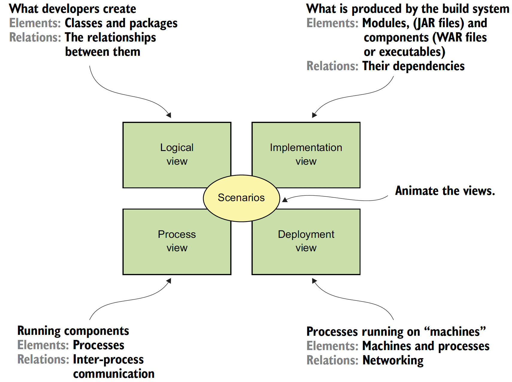
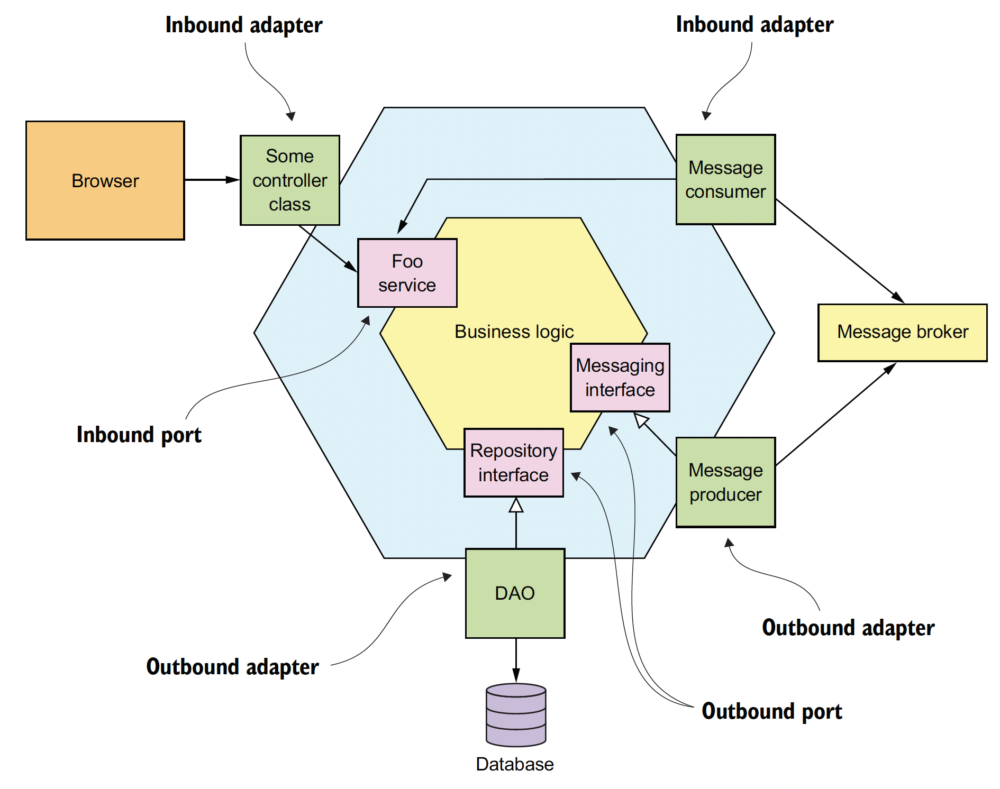
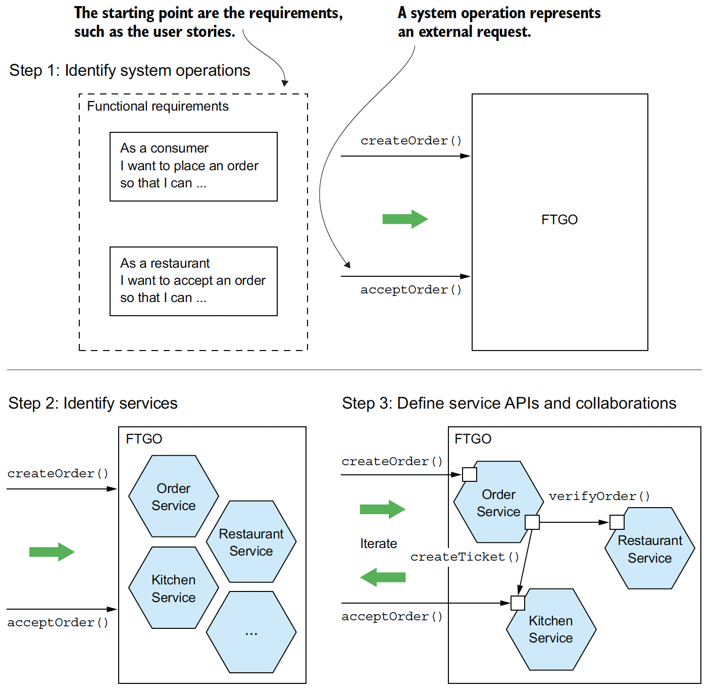
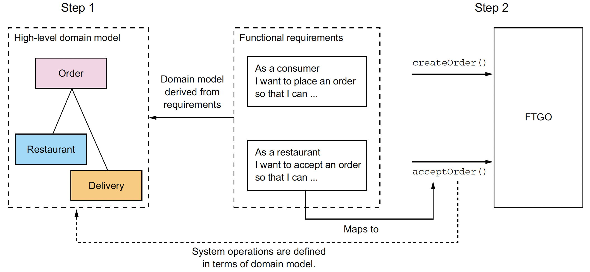

# Chapter 02. Decomposition strategies

- The key challenge, which is the essence of the microservice architecture, is the functional decomposition of the application into services. The first and most important aspect of the architecture is therefore, the definition of the services

## 2.1 What is the microservice architecture exactly? 
- **WHAT**: The architecture of a software application is its high-level structure, which consists of constituent parts and the dependencies between those parts

### 2.1.1 What is software architecture and why does it matter? 
#### A DEFINITION OF SOFTWARE ARCHITECTURE
> The software architecture of a computing system is the set of structures needed to reason about
> the system, which comprise software elements, relations among them, and properties of both.
> 
> Documenting Software Architectures by Bass et al.

- **WHY** Decomposition
  - It facilitates the division of labor and knowledge
  - It defines how the software elements interact

#### THE 4+1 VIEW MODEL OF SOFTWARE ARCHITECTURE
- REFERENCE: [Architectural Blueprints—The '4+1' View Model of Software Architecture](www.cs.ubc.ca/~gregor/teaching/papers/4+1view-architecture.pdf)
- The 4+1 view model describes an application's architecture using four views, along with scenarios that show how the elements within each view collaborate to handle requests.

  

#### WHY ARCHITECTURE MATTERS
- An application has two categories of requirements
  - The first category includes the functional requirements, which define what the application must do. They’re usually in the form of use cases or user stories. Architecture has very little to do with the functional requirements
- **WHY**: it enables an application to satisfy the second category of requirements: its quality of service requirements (a.k.a. *quality attributes*, *-ilities*)
  - The quality of service requirements define the runtime qualities such as scalability and reliability. They also define development time qualities including maintainability, testability, and deployability

### 2.1.2 Overview of architectural styles

- Definitions by [An Introduction to Software Architecture, January 1994](https://www.cs.cmu.edu/afs/cs/project/able/ftp/intro_softarch/intro_softarch.pdf)
  - An architectural style, then, defines a family of such systems in terms of a pattern of structural organization. More specifically, an architectural style determines the vocabulary of components and connectors that can be used in instances of that style, together with a set of constraints on how they can be combined.

#### THE LAYERED ARCHITECTURAL STYLE
- A layered architecture organizes software elements into layers
  - Each layer has a well-defined set of responsibilities
  - A layer can only depend on either the layer immediately below it (if strict layering) or any of the layers below it.
- It organizes the application's classes into the following tiers or layers:
  - Presentation layer -- Contains code that implements the user interface or external APIs
  - Business logic layer -- Contains the business logic
  - Persistence layer -- Implements the logic of interacting with the database
- Some significant drawbacks
  - Single presentation layer -- It doesn’t represent the fact that an application is likely to be invoked by more than just a single system.
  - Single persistence layer -- It doesn’t represent the fact that an application is likely to interact with more than just a single database.
  - Defines the business logic layer as depending on the persistence layer -- In theory, this dependency prevents you from testing the business logic without the database

#### ABOUT THE HEXAGONAL ARCHITECTURE STYLE
- Example: An example of a hexagonal architecture, which consists of the business logic and one or more adapters that communicate with external systems. The business logic has one or more ports. Inbound adapters, which handled requests from external systems, invoke an inbound port. An outbound adapter implements an outbound port, and invokes an external system.

  
- 3 components 
  - **the business logic** at the center
    - the business logic has one or more **ports**. A port defines a set of operations and is how the business logic interacts with what's outside of it
      - In Java, for example, a port is often a Java interface
      - There are two kinds of ports: inbound and outbound ports.
        - An inbound port is an API exposed by the business logic, which enables it to be invoked by external applications, e.g. a service interface defining a service's public methods
        - An outbound port is how the business logic invokes external systems. e.g. a repository interface, which defines a collection of data access operations
  - one or more **inbound adapters** handle requests from the outside by invoking the inbound port of the business logic. e.g. a Spring MVC Controller
  - one or more **outbound adapters** that are invoked by the business logic and invoke external applications or service. e.g. DAO (data access object)
- Benefits
  - It decouples the business logic from the presentation and data access logic in the adapters
- It more accurately reflects the architecture of a modern application
  - The business logic can be invoked via multiple adapters, each of which implements a particular API or UI
  - The business logic can also invoke multiple adapters, each one of which invokes a different external system.

### 2.1.3 The microservice architecture is an architectural style
> Pattern: **Monolithic architecture**  
> Structure the application as a single executable/deployable component. See http://microservices.io/patterns/monolithic.html.

> Pattern: **Microservice architecture**  
> Structure the application as a collection of **loosely coupled**, independently deployable services. See http://microservices.io/patterns/microservices.html. 

  - The components are services, and the connectors are the communication protocols that enable those services to collaborate
  - The connectors between services are implemented using interprocess communication mechanisms such as REST APIs and asynchronous messaging
  - Each service has its own logical view architecture, which is typically a hexagonal architecture

#### WHAT IS A SERVICE?
- A service is a standalone, **independently deployable** software component that implements some useful functionality
- A service has an API that provides its clients access to its functionality
  - 2 types of operations: **commands** and **queries**
  - The API consists of **commands**, **queries**, and **events**.

#### WHAT IS LOOSE COUPLING?
- All interaction with a service happens via its API, which encapsulates its implementation details
- The requirement for services to be loosely coupled and to collaborate only via APIs prohibits services from communicating via a database
- One downside of not sharing databases is that maintaining data consistency and querying across services are more complex

#### THE ROLE OF SHARED LIBRARIES
- Libraries should only be used for functionality that's unlikely to change

#### THE SIZE OF A SERVICE IS MOSTLY UNIMPORTANT
- A much better goal is to define a well-designed service to be a service capable of being developed by a small team with minimal lead time and with minimal collaboration with other teams

## 2.2 Defining an application’s microservice architecture
- 3-step process
  1. An application exists to handle requests, so the first step in defining its architecture is to distill the application's requirements into the key requests in term of **system operation**
      - A system operation is an abstraction of a request that the application must handle. It's either a command, which updates data, or a query, which retrieves data
  2. Determine the decomposition into services using the either of strategies
      - by business capabilities
      - by domain-driven design subdomains
  3. Determine each service's API

  

- Obstacles to decomposition
  - network latency
  - synchronous communication between services reduces availability
  - the requirement to maintain data consistency across services
  - so-called **god classes** used throughout an application

### Identifying the system operations
- The starting point is the application's requirements, including user stories and their associated user scenarios (note that these are different from the architectural scenarios)
- Two-step process
  1. Create a high-level domain model (mostly derived primarily from the nouns of the user stories)
  2. Define the system operations (derived mostly from the verbs) in terms of the domain model
     - The behavior of each system operation is described in terms of its effect on one or more domain objects and the relationships between them

  

#### CREATING A HIGH-LEVEL DOMAIN MODEL
- The domain model is much simpler than what will ultimately be implemented
- Example: the Place Order story expanded into numerous user scenarios (**GWT** sytle) including this one:

  ```text
  Given a consumer
    And a restaurant
    And a delivery address/time that can be served by that restaurant
    And an order total that meets the restaurant's order minimum
  When the consumer places an order for the restaurant
  Then consumer's credit card is authorized
    And an order is created in the PENDING_ACCEPTANCE state
    And the order is associated with the consumer
    And the order is associated with the restaurant
  ```

#### DEFINING SYSTEM OPERATIONS
- Two types
  - **Commands** -- System operations that create, update, and delete data
  - **Queries** -- System operations that read (query) data
- A good starting point for identifying system commands is to analyze the verbs in the user stories and scenarios
- A command has a specification that defines its parameters, return value, and behavior in terms of the domain model classes
  - The behavior specification consists of preconditions that must be true when the operation is invoked, and post-conditions that are true after the operation is invoked
    - The preconditions mirror the givens in the *Place Order* user scenario described earlier
    - The post-conditions mirror the thens from the scenario
    - When a system operation is invoked it will verify the preconditions and perform the actions required to make the post-conditions true
  - Example: the `createOrder()` system operation:

    |       Operation | `createOrder(consumer id, payment method, delivery address, delivery time, restaurant id, order line items)` |
    | --------------: | :----------------------------------------------------------------------------------------------------------- |
    |         Returns | `orderId`, ...                                                                                               |
    |   Preconditions | The consumer exists and can place orders                                                                     |
    |   Preconditions | The line items correspond to the restaurant's menu items                                                     |
    |   Preconditions | The delivery address and time can be serviced by the restaurant                                              |
    | Post-conditions | The consumer's credit card was authorized for the order total                                                |
    | Post-conditions | An order was created in the PENDING_ACCEPTANCE state                                                         |


### 2.2.2 Defining services by applying the Decompose by business capability pattern
- A business capability is something that a business does in order to generate value
> **Pattern: Decompose by business capability**   
> Define services corresponding to business capabilities. See http://microservices.io/patterns/decomposition/decompose-by-business-capability.html

#### BUSINESS CAPABILITIES DEFINE WHAT AN ORGANIZATION DOES
- An organization's business capabilities capture **what** an organization's business is
- They're generally stable, as opposed to how an organization conducts its business, which changes over time, sometimes dramatically

#### IDENTIFYING BUSINESS CAPABILITIES
- An organization's business capabilities are identified by analyzing the organization's purpose, structure, and business processes
- Each business capability can be thought of as a service, except it's business-oriented rather than technical
- Its specification consists of various components, including inputs, outputs, and service-level agreements
- A business capability is often focused on a particular business object

#### FROM BUSINESS CAPABILITIES TO SERVICES
- The decision of which level of the capability hierarchy to map to services, is somewhat subjective
- An important step in the architecture definition process is investigating how the services collaborate in each of the key architectural services

### 2.2.3 Defining services by applying the Decompose by sub-domain pattern
- A domain mode captures knowledge about a domain in a form that can be used to solve problems within that domain
- DDD has two concepts that are incredibly useful when applying the microservice architecture: **subdomains** and **bounded contexts**

> **Pattern: Decompose by subdomain**  
> Define services corresponding to DDD subdomains. See http://microservices.io/patterns/decomposition/decompose-by-subdomain.html.

- The traditional approach to enterprise modeling creates a single model for the entire enterprise, suffering from
  - Getting different parts of an organization to agree on a single model is a monumental task
  - From the perspective of a given part of the organization, the model is overly complex for their needs
  - The domain model can be confusing because different parts of the organization might use either the same term for different concepts or different terms for the same concept
- DDD defines a separate domain model for each subdomain
  - Subdomains are identified using the same approach as identifying business capabilities: analyze the business and identify the different areas of expertise
- DDD calls the scope of a domain model a **bounded context**
  - A bounded context includes the code artifacts that implement the model
  - When using the microservice architecture, each bounded context is a service or possibly a set of services

### 2.2.4 Decomposition guidelines
- 2 principles
  - The Single Responsibility Principle (SRP), for defining the responsibilities of a class
  - The Common Closure Principle (CCP), for organizing classes into packages

#### SINGLE RESPONSIBILITY PRINCIPLE

> A class should have only one reason to change.  
> Robert C. Martin

- If a class has multiple responsibilities that change independently, the class won’t be stable 
- We can apply SRP when defining a microservice architecture and create small, cohesive services that each have a single responsibility. This will reduce the size of the services and increase their stability

#### COMMON CLOSURE PRINCIPLE
> The classes in a package should be closed together against the same kinds of changes. A change that affects a package affects all the classes in that package.  
> Robert C. Martin

- We can apply CCP when creating a microservice architecture and package components that change for the same reason into the same service
  - Doing this will minimize the number of services that need to be changed and deployed when some requirement changes

- SRP and CCP are 2 of the [11 principles](http://butunclebob.com/ArticleS.UncleBob.PrinciplesOfOod) developed by Bob Martin

### 2.2.5 Obstacles to decomposing an application into services
- Network latency
- Reduced availability due to synchronous communication
- Maintaining data consistency across services
- Obtaining a consistent view of the data
- God classes preventing decomposition

#### NETWORK LATENCY
- Sometimes, you can reduce the latency to an acceptable amount by implementing a batch API for fetching multiple objects in a single round trip
- But in other situations, the solution is to combine services, replacing expensive IPC with language-level method or function calls

#### SYNCHRONOUS INTERPROCESS COMMUNICATION REDUCES AVAILABILITY
- Asynchronous messaging, which eliminates tight coupling and improves availability, is often a better choice

#### MAINTAINING DATA CONSISTENCY ACROSS SERVICES
- The traditional solution is to use a two-phase, commit-based, distributed transaction management mechanism
  - A very different but better approach to transaction management, a saga
    - A saga is a sequence of local transactions that are coordinated
    - One limitation of sagas is that they are eventually consistent. If you need to update some data atomically, then it must reside within a single service, which can be an obstacle to decomposition using messaging

#### OBTAINING A CONSISTENT VIEW OF THE DATA
- If you need a consistent view of some data, then it must reside in a single service, which can prevent decomposition
- Fortunately, in practice this is rarely a problem

#### GOD CLASSES PREVENT DECOMPOSITION
- 3 solutions

  |                                                                                                                                                          HOW | Trouble                                                                                                                                                                                                            |
  | -----------------------------------------------------------------------------------------------------------------------------------------------------------: | :----------------------------------------------------------------------------------------------------------------------------------------------------------------------------------------------------------------- |
  | Package the Order class into a library and create a central Order database. All services that process orders use this library and access the access database | It violates one of the key principles of the microservice architecture and results in undesirable, tight coupling. For example, any change to the Order schema requires the teams to update their code in lockstep |
  |                                     Encapsulate the Order database in an Order Service, which is invoked by the other services to retrieve and update orders | The Order Service would be a data service with an anemic domain model containing little or no business logic                                                                                                       |
  |                                                                           Apply DDD and treat each service as a separate subdomain with its own domain model | N/A                                                                                                                                                                                                                |

- Problem: As well as creating technical challenges, having multiple domain models also impacts the implementation of the user experience. An application must translate between the user experience, which is its own domain model, and the domain models of each of the services

### 2.2.6 Defining service APIs
- Components
  - Operations
    - WHY
      - Some operations correspond to system operations. They are invoked by external clients and perhaps by other services
      - The other operations exist to support collaboration between services. These operations are only invoked by other services
  - Events: enable services to collaborate with other services
- HOW
  - Map each system operation to a service
  - Decide whether a service needs to collaborate with others to implement a system operation
    - If collaboration is required, we then determine what APIs those other services must provide in order to support the collaboration

#### ASSIGNING SYSTEM OPERATIONS TO SERVICES
- Decide the service which is the initial entry point for a request
  - Sometimes, assigning an operation to a service that needs the information provided by the operation is a better choice
  - Others, it might make sense to assign an operation to the service that has the information necessary to handle it

#### DETERMINING THE APIS REQUIRED TO SUPPORT COLLABORATION BETWEEN SERVICES
- WHEN: The data needed to handle one of these requests might, for instance, be scattered around multiple services
  - Example: `createOrder`
    - The Consumer Service -- Verify that the consumer can place an order and obtain their payment information
    - Restaurant Service -- Validate the order line items, verify that the delivery address/time is within the restaurant's service area, verify order minimum is met, and obtain prices for the order line items
    - Kitchen Service -- Create the Ticket
    - Accounting Service -- Authorize the consumer's credit card